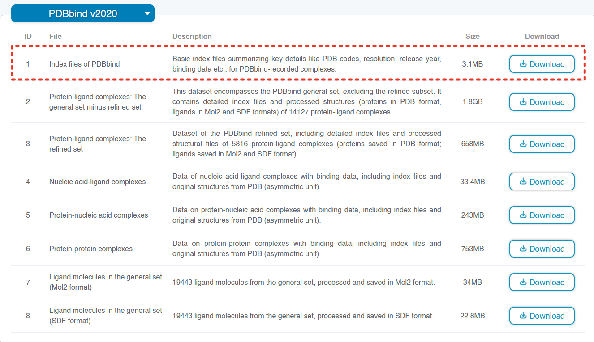

# DiffDock-VdW
DiffDock-VdW is a feature augmentation of DiffDock that updates the preprocessing algorithm to include VdW features at the atom-node level. Specifically, DiffDock-VdW is a fork of [DiffDockHPC](https://github.com/Jnelen/DiffDockHPC) (a fork of [DiffDock](https://github.com/gcorso/DiffDock)) which provides users HPC DiffDock functionality through Singularity and Slurm.

## The Organization of the Information Below
1. Requirements
2. Running DiffDock-VdW using our VdW models
3. Reproducing our procedure (Data preprocessing with HiQBind -> Model Training -> Model Validation)

## 1. Requirements
### Software Requirements:
* Singularity 
* Slurm* (Though not required, our examples will make use of it)

### Hardware Requirements
* **Inference:** Run-time execution is lightweight and compatible with standard modern GPUs.
* **Training Replication:** Reproducing the full ablation study requires a minimum of **80GB VRAM** (e.g., NVIDIA A100 80GB).

## 2. Running our DiffDock-VdW models
### Installation instructions:
1. Clone the repository and navigate to it
    ```
    git clone https://github.com/Kamal-R-Albousafi/DiffDockVdW
    ```
   ```
   cd DiffDockVdW
   ```
   
2. **Install the Singularity image**. There are multiple methods of doing this. From [DiffDockHPC](https://github.com/Jnelen/DiffDockHPC): Run a test example to automatically download the Singularity image (~3 GB) and to generate the necessary cache look-up tables for SO(2) and SO(3) distributions. (This only needs to happen once and usually takes around 15 minutes).  
   The `--no_slurm` flag is optional here, but makes it easier to track the progress.   
   ```
   python inferenceVS.py -p data/1a0q/1a0q_protein_processed.pdb -l data/1a0q/ -out TEST -j 1 --no_slurm
   ```  
   Or if you have access to a GPU, you can also add the -gpu tag like this:  
   ```
   python inferenceVS.py -p data/1a0q/1a0q_protein_processed.pdb -l data/1a0q/ -out TEST -j 1 -gpu --no_slurm
   ```  
[DiffDockHPC](https://github.com/Jnelen/DiffDockHPC) additionally provides a method to manually download the Singularity image:
   ```
   wget --no-check-certificate -r "https://drive.usercontent.google.com/download?id=1TsbuhNWA74AHfIbKV5uh2lmEnD99VlCD&confirm=t" -O singularity/DiffDockHPC.sif
   ```
   
   Likewise, you can build the singularity image yourself using:
   ```
   singularity build singularity/DiffDockHPC.sif singularity/DiffDockHPC.def
   ```

<!--
   Optionally, if you intend on running many jobs in quick succession (i.e. debugging or preliminary jobs), you can sandbox the singularity image (There are examples of jobs with using both the sif and the sandbox in the examples section below) :
   ```
   singularity build --sandbox singularity/DiffDockHPC DiffDockHPC.sif
   ```
-->

3. Note: When training the models (or running inference without inferenceVS), you must bind the batchnorm fix from the mye3nn folder to the singularity image. The srun examples below demonstrate this fix in greater detail.

4. Download and unzip our model weights: [Download weights](https://github.com/Kamal-R-Albousafi/DiffDockVdW/releases/download/v1.1.3/diffdockvdw_models.tar.gz)

   You can also download them using wget to place them directly onto your compute cluster:
   ```
   wget https://github.com/Kamal-R-Albousafi/DiffDockVdW/releases/download/v1.1.3/diffdockvdw_models.tar.gz
   ```
5. You are now ready to run inference. Placing the confidence_model and score_model folders into your DiffDockVdW directory will allow inference to be run with the following command (within a sbatch file; ensure your chosen partition has a gpu available):

```
# Example inference command
cd DiffDockVdW
SIF=singularity/DiffDockHPC.sif
BIND_DIR=$PWD
INTERNAL_PATH="/opt/conda/envs/DiffDockHPC/lib/python3.9/site-packages/e3nn/nn/_batchnorm.py"
srun singularity run --nv \
    --bind $BIND_DIR:$BIND_DIR,/scratch:/scratch\
    --bind $PWD/mye3nn/fixed_batchnorm.py:$INTERNAL_PATH \
    $SIF \
    python inference.py \
        --protein_ligand_csv data/your_protein_ligand.csv \
        --model_dir score_model \
        --ckpt best_ema_inference_epoch_model.pt \
        --confidence_model_dir confidence_model \
        --confidence_ckpt best_model_epoch75.pt \
        --out_dir $RES_DIR/activators \
        --samples_per_complex 20 \
        --inference_steps 20 \
        --actual_steps 19 \
        --batch_size 20
```
Furthermore, the additional inference options can be found around line 60 in inference.py. As an additional note, if you are running inference with a model you trained with a different combination of vdw features, model_parameters.yml will track which ones you used; therefore, no vdw flags need to be used to run inference.py.

## 3. Reproducing our Results
### Contents
1. Obtaining the HiQBind-corrected PDBBindv2020 dataset
2. Training the score model
3. Training the confidence model
4. Evaluation

### Obtaining the HiQBind-corrected PDBBindv2020 dataset
1. Obtain the INDEX_general_PL.2020 file from the official [PDBBind website](https://www.pdbbind-plus.org.cn/download) (you will need to create an account to download data) and place the file in an accessible location, preferably under `helper_files/`. Below is an image detailing which folder to download. 


The downloaded folder `v2020Index` will have the following structure:
```
v2020Index/
├── index/
|   ├── 2020_index.lst
|   ├── INDEX_general_NL.2020
|   ├── INDEX_general_PL_data.2020
|   ├── INDEX_general_PL_name.2020
|   ├── INDEX_general_PL.2020       <--- This is the required file
|   ├── other_files...
└── readme/
```

3. Run the following command to obtain the INDEX_filtered_no_overlap.2020 file.
```
cd DiffDockVdW
python helper_files/v2020filter.py
```
3. Perform steps 2a and 3 (under the header ''Alternatively, for processing PDBBind, use these codes instead'') from [HiQBind's How to reconstruct HiQBind and Optimized PDBBind Section](https://github.com/THGLab/HiQBind#how-to-reconstruct-hiqbind-and-optimized-pdbbind), making sure to replace ''INDEX_general_PL.2020'' with ''INDEX_filtered_no_overlap.2020''. It should be noted that these files will take up a lot of space and therefore should be placed in a location with adequate (50GB+) storage. 
4.  We provide a helper file helper_files/hiqbind_for_diffdock.py that will convert the output of these steps into a DiffDock-ready format. Note that the placeholder file names for `raw_data_path` and `refined_base_path` will need to be replaced.

Ideally, the data format should look like:
```
refined_pdb_data/
├── 1o3c/
│   ├── 1o3c_ligand.sdf
│   └── 1o3c_protein_processed.pdb
├── other_pdb_codes...
```
### Training the score model
There are a lot of fine details here, but below are a few key details of particular importance:
1. utils/parsing.py includes all of the training arguments. While many of these are not too important, a couple of them are vital and easy to miss. Here a few notable ones:
    - **a.** `--vdw_base`, `--vdw_curv`, `--vdw_vol`: These are store_true flags that tell the model which VdW features to encode (any combination may be used). Seperate cache directories will be created for each attempt at creating a different combination. Furthermore, if any of these flags are used, the `all_atoms` flag is automatically set to true as the vdw features are not implemented for the course grained model.
    - **b.** `--dropout`: This is the MLP neuron dropout rate. It's default is 0.0, but to avoid overfitting of the model, it is highly recommended to use at least 0.1 for this parameter.
    - **c.** `--restart_dir`, `--restart_ckpt`; `save_model_freq`: As with any large model training procedure, it is recommended to checkpoint your model every so often. We noticed that `save_model_freq` does not actually save the optimizer state, so if you wished to restart training from a specific epoch, you would be out of luck as the program would throw an error and default to restarting from the most previous checkpoint. To this end, we implemented a store_true flag `save_optim` that ensures the optimizer states are saved each time model weights are checkpointed. This proved to be an astronomical time save as we noticed the all atom models we were training had a decent chance to derail to numeric instability after following a poor gradient. 
2. Below is the command we used to train our top VdW score model (ensure partition has gpu available). Note that `--cache_path`, `--run_name`, and `--log_dir` each have placeholder names.
```
SIF=singularity/DiffDockHPC.sif
BIND_DIR=$PWD
INTERNAL_PATH="/opt/conda/envs/DiffDockHPC/lib/python3.9/site-packages/e3nn/nn/_batchnorm.py"
srun singularity run --nv \
    --bind $BIND_DIR:$BIND_DIR,/scratch:/scratch\
    --bind $PWD/mye3nn/fixed_batchnorm.py:$INTERNAL_PATH \
    $SIF \
    python train.py \
    --split_train data/hiqbindsplits/refined_timesplit_train \
    --split_val data/hiqbindsplits/refined_timesplit_val \
    --split_test data/hiqbindsplits/refined_timesplit_test \
    --pdbbind_dir PATH_TO_DATA \
    --cache_path PATH_YOU_WANT_COMPLEXES_CACHED \
    --n_epochs 210 \
    --run_name ENTER_YOUR_RUN_NAME_HERE \
    --batch_size 16 \
    --save_model_freq 10 \
    --val_inference_freq 10 \
    --num_inference_complexes 200 \
    --inference_samples 20 \
    --scheduler plateau \
    --scheduler_patience 20 \
    --dropout 0.1 \
    --receptor_radius 30.0 \
    --atom_radius 5.0 \
    --use_ema \
    --limit_complexes 0 \
    --c_alpha_max_neighbors 12 \
    --atom_max_neighbors 16 \
    --all_atoms \
    --vdw_base \
    --vdw_curv \
    --vdw_vol \
    --num_conv_layers 4 \
    --ns 16 \
    --nv 8 \
    --use_second_order_repr \
    --distance_embed_dim 64 \
    --cross_distance_embed_dim 64 \
    --cross_max_distance 30 \
    --cudnn_benchmark \
    --log_dir PATH_YOU_WANT_YOUR_MODELS_SAVED
```

### Training the confidence model
Similar to the score model, there are a lot of key training arguments that can easily be glossed over.
1. The train arguments for training the confidence model can be found at line 25 of confidence_train.py
2. Key notes: the confidence model can actually use an entirely different set of configurations and number of vdw features than the trained score model. The only time you will get errors in this manner is if you make a change to how data should be pre-processed but still used the old data cache. Furthermore, the flags `--vdw_base`, `--vdw_curv`, `--vdw_vol` are once again present to allow for any combination of vdw features
3. Once again, `confidence_dropout` has a default of 0.0 and is highly recommended to be at least 0.1
4. Below is the command we used to train our VdW confidence model. If your confidence model has the same preprocessing settings as your score model (this is highly recommended), the `--use_original_model_cache` will use the same complexes that were cached from when you trained your score model. Furthermore, `--original_model_dir`, `run_name`, `--cache_path`, and `--log_dir` each have placeholder names.
```
SIF=singularity/DiffDockHPC.sif
BIND_DIR=$PWD
INTERNAL_PATH="/opt/conda/envs/DiffDockHPC/lib/python3.9/site-packages/e3nn/nn/_batchnorm.py"
srun singularity run --nv \
    --bind $BIND_DIR:$BIND_DIR,/scratch:/scratch\
    --bind $PWD/mye3nn/fixed_batchnorm.py:$INTERNAL_PATH \
    $SIF \
    python confidence_train.py \
    --original_model_dir YOUR_SCORE_MODEL_PATH/RUN_NAME \
    --use_original_model_cache \
    --ckpt best_ema_inference_epoch_model.pt \
    --model_save_frequency 15 \
    --best_model_save_frequency 5 \
    --run_name YOUR_RUN_NAME_FOR_CONFIDENCE_MODEL \
    --split_train data/hiqbindsplits/refined_timesplit_train \
    --split_val data/hiqbindsplits/refined_timesplit_val \
    --cache_path PATH_YOU_WANT_INFERENCE_SAMPLES_CACHED \
    --inference_steps 20 \
    --samples_per_complex 16 \
    --log_dir PATH_YOU_WANT_CONFIDENCE_MODELS_SAVED \
    --batch_size 16 \
    --lr 0.0003 \
    --scheduler plateau \
    --scheduler_patience 20 \
    --n_epochs 75 \
    --receptor_radius 30.0 \
    --atom_radius 5.0 \
    --limit_complexes 0 \
    --c_alpha_max_neighbors 12 \
    --atom_max_neighbors 16 \
    --all_atoms \
    --num_conv_layers 4 \
    --ns 16 \
    --nv 6 \
    --distance_embed_dim 64 \
    --cross_distance_embed_dim 64 \
    --use_second_order_repr \
    --cross_max_distance 30 \
    --confidence_dropout 0.1 \
    --vdw_base \
    --vdw_curv \
    --vdw_vol 
```

## License
MIT
